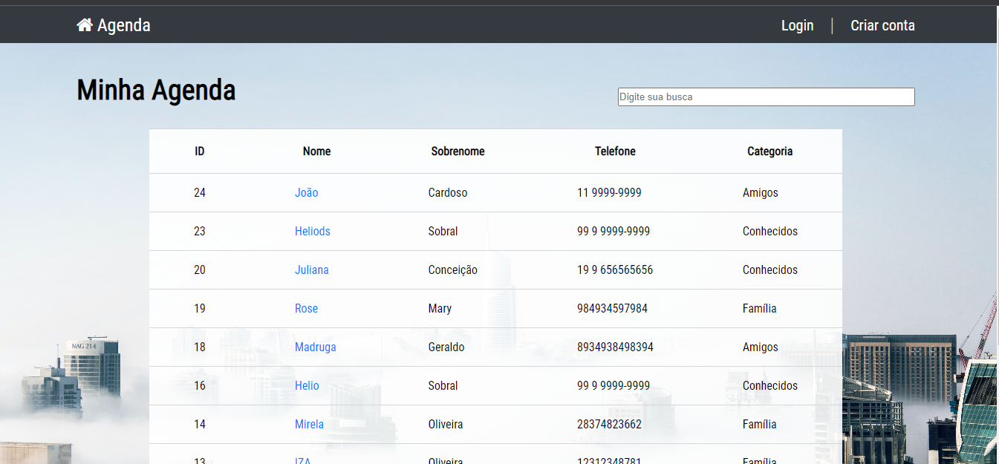

# agenda-django
agenda telefônica com sistema de login. Python, Django

<h2>projeto está online em: 
http://34.151.251.68/ </h2>

<h3>-Construída em Python utilizando Django, Database Mysql. </h3>

<h3>-Front-end com HTML e CSS.</h3>

Na página principal acessamos a lista de todos os contatos salvos, com páginação.
Também podemos visualisar uma página individual para cada contato, ver sua foto e outras informações, bem como editar seus dados ou excluír o contato.
Para salvar um novo contato é preciso ser um usuário registrado, assim a agenda também possui sistema de cadastro e login.

Este projeto foi construído em curso. O deploy foi feito na google cloud plataform, onde configuramos uma maquina virtual.
